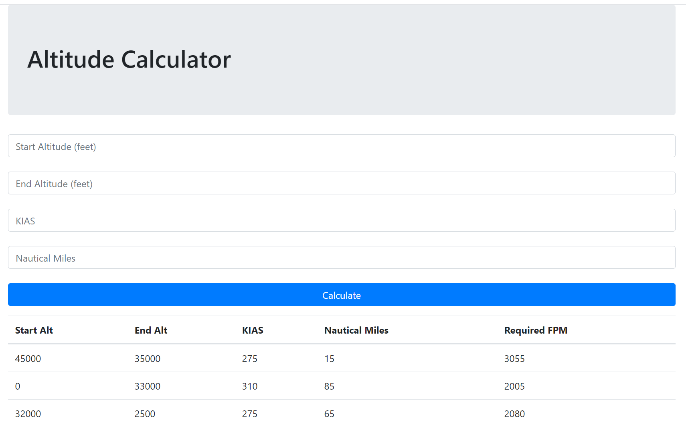

# Altitude Calculator
 
This simple tool returns to the user the required feet-per-minute for a flight-level-change given:
<ol>
<li>Starting altitude</li>
<li>Ending altitude</li>
<li>Knots In Air Speed</li>
<li>Distance in Nautical Miles</li>
</ol>

See example_image for how the broswer runs in localhost.
 
If you are a windows user then double clicking run.cmd will start the server, then go to the address provided in the terminal.
 
### Example Image
